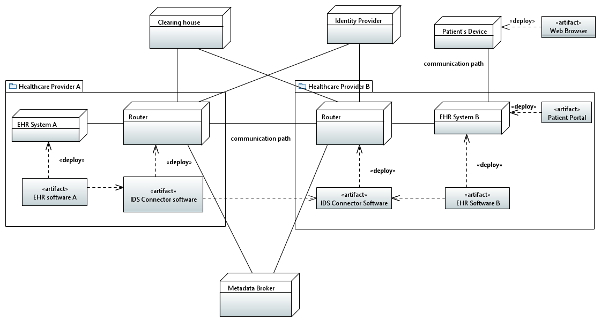
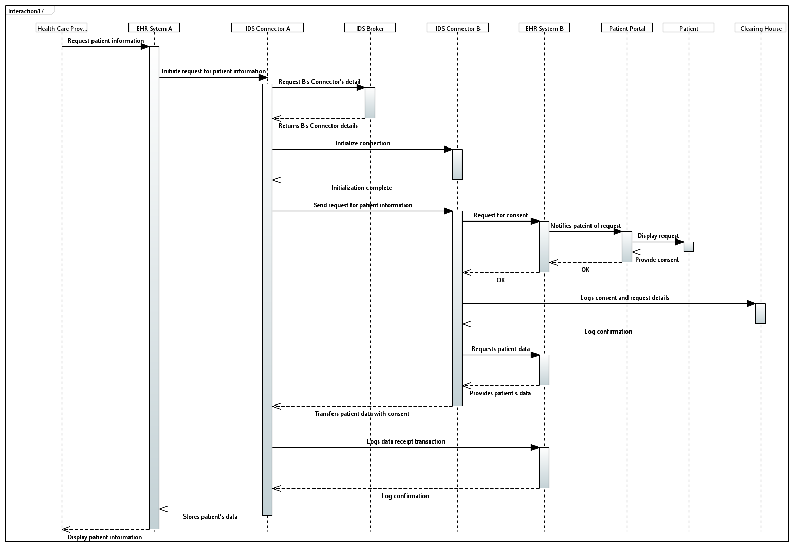

# Use Case 1

#### Use Case 1: Cross-Organizational Care&#x20;

A patient currently treated by one healthcare provider receives informed care while visiting another healthcare provider. Patient information is exchanged between the healthcare providers.&#x20;

#### Deployment Diagram

<figure><figcaption>
Deployment diagram
</figcaption></figure>

#### Sequence Diagram

<figure><figcaption>
Sequence Diagram
</figcaption></figure>