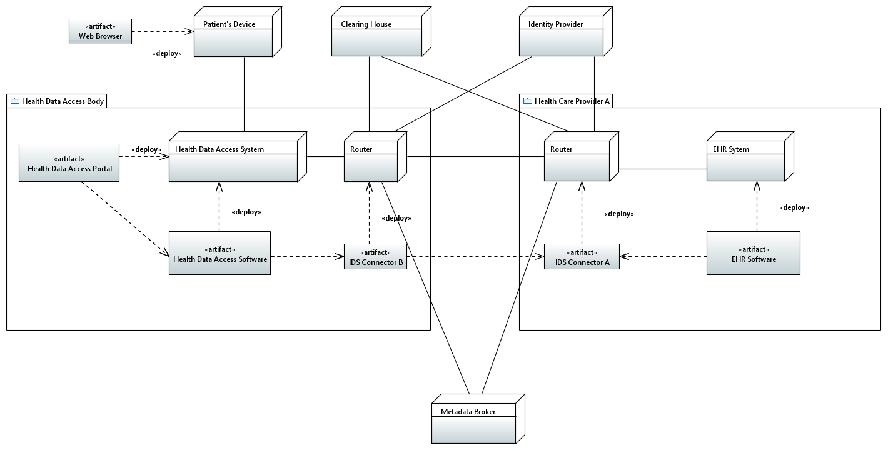
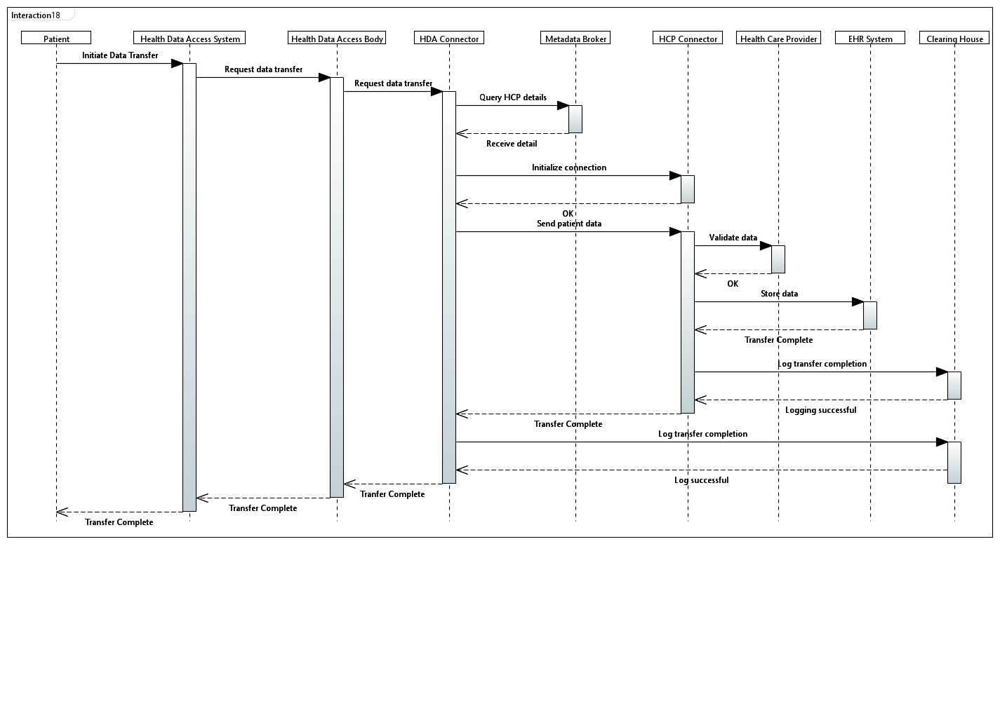

# Use Case 2

#### Use Case 2: Second Opinion Consultatio&#x20;

Patients share their health records via a patient portal with a specialist in another EU country, enabling a detailed second opinion on a diagnosis or treatment plan without geographical barriers.\

The patient, via his/her web browser, accesses a Health Data Access Portal maintained by the country's Health Data Access Body. From this portal, the patient requests to transfer his/her health data to a Health care provider.&#x20;

#### Deployment Diagram

<figure><figcaption>
Deployment Diagram
</figcaption></figure>

#### Sequence Diagram

<figure><figcaption>
Sequence Diagram
</figcaption></figure>