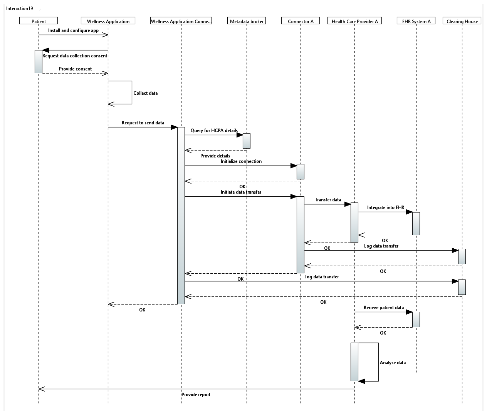

# Use Case 3

#### Use Case 3: Tracking Vitals&#x20;

The patient goes to a healthcare provider, who decides to track the patient's vitals for a week and set the time interval. After this, the data collected by the wellness application should be sent to the HCP, who analyzes it and provides the patient with information.

#### Sequence Diagram

<figure><figcaption>
Sequence Diagram
</figcaption></figure>