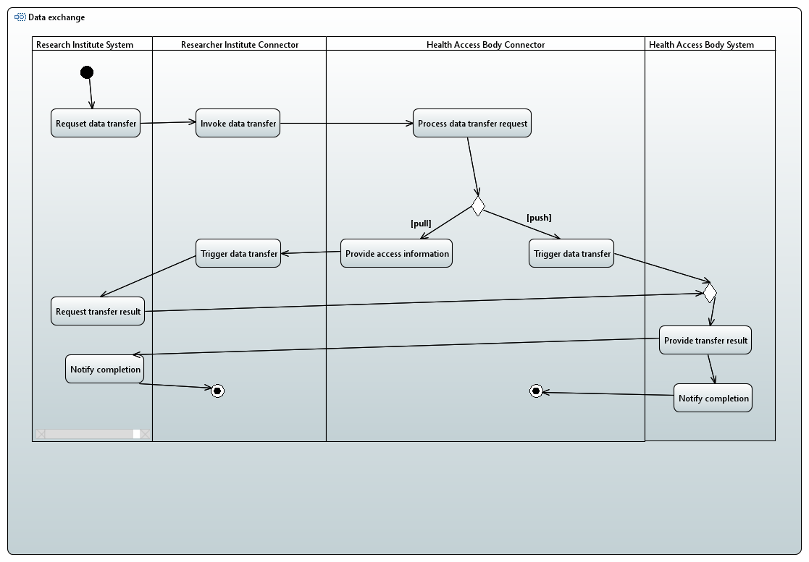

# Use case 4: Data sharing for research

This case shows the interaction between a research institute wanting a dataset of a specific disease from a health access body of that particular country. The data transfer depicted in the behavioural diagrams assumes that the channel has been established and contract negotiation has been completed between the institute and the health access body. &#x20;

#### Activity Diagram

<figure><figcaption>
Activity Diagram
</figcaption></figure>